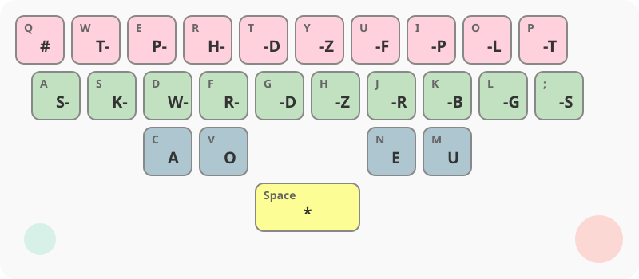
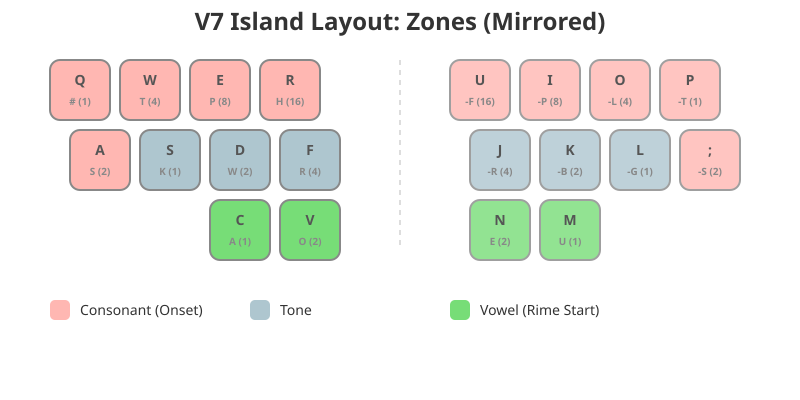
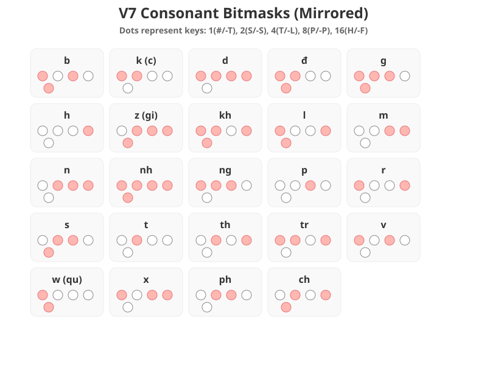
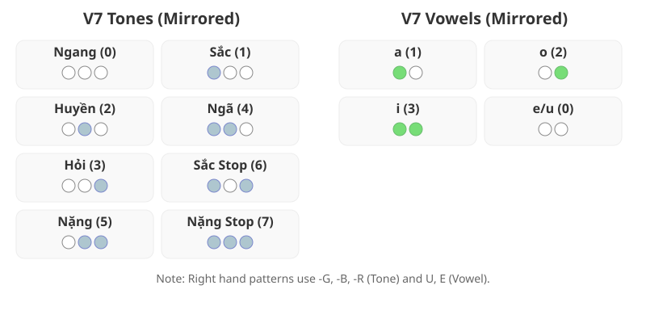

# V7 Web Demo Documentation

This document describes the implementation and usage of the V7 Text Prediction Engine web demo.

## Overview

The web demo provides a real-time stenographic input interface for the V7 inference engine. It is designed to be used with a QWERTY keyboard mapped to a stenographic layout, or a dedicated steno machine configured as a QWERTY keyboard.

## Key Features

- **Real-time Inference:** Decodes V7 code islands in context with fixed text islands.
- **Ambiguity Management:** Presents up to 5 candidates for V7 islands.
- **Seamless Mode Switching:** Automatically switches between fully specified syllables (fixed text) and partially specified V7 islands based on the input chord.
- **History & Undo:** Supports undoing the last action (syllable entry, V7 island entry, or candidate selection) using the `*` key.
- **Smart Spacing:** Automatically manages spacing between different types of content (Vietnamese text, punctuation, capitals) to prevent double spacing.
- **Emily Symbols:** Supports Emily symbol strokes with configurable attachment spacing.
- **Mobile Friendly:** Optimized for display on mobile devices with external keyboards.

## Island Types & Spacing Rules

The frontend organizes text into "islands" to manage spacing intelligently. The types are:

*   **Vietnamese:** Whole syllables or V7 partially specified syllable pairs.
*   **Punctuation:** `.` `,` `!` `?`.
*   **Capital Letter:** Literal uppercase letters.
*   **Spacing:** Explicit Space or Newline.
*   **Emily:** Emily symbol output (e.g. punctuation-like symbols with explicit attachment spacing).

**Spacing Rules:**
*   **Vietnamese ↔ Vietnamese:** Space added.
*   **Vietnamese → Capital:** Space added (e.g., `Xin Chào`).
*   **Punctuation → Vietnamese:** Space added (e.g., `. Xin`).
*   **Punctuation → Capital:** Space added (e.g., `. A`).
*   **Capital → Capital:** No space (e.g., `USA`).
*   **Capital → Vietnamese:** No space (e.g., `The`).
*   **Punctuation → Punctuation:** No space.
*   **Any ↔ Spacing:** No extra space added.
*   **Emily Symbols:** Explicit attachment metadata controls whether spacing is added around the symbol.

## Getting Started

### Prerequisites

- Build the Rust inference engine: `cd inference-rs && cargo build --release`.
- Ensure `lm.binary` and `generated_regexes.json` are in the project root.

### Running the Server

Start the inference engine in server mode:

```bash
./inference-rs/target/release/inference-rs --server --port 3000 --static-dir static
```

Access the demo at `http://localhost:3000`.

## Stenographic Layout

The demo uses a QWERTY-to-Steno mapping:



| QWERTY | Steno | QWERTY | Steno |
| :--- | :--- | :--- | :--- |
| `Q` | `#` | `U` | `-F` |
| `A` | `S-` | `J` | `-R` |
| `W` | `T-` | `I` | `-P` |
| `S` | `K-` | `K` | `-B` |
| `E` | `P-` | `O` | `-L` |
| `D` | `W-` | `L` | `-G` |
| `R` | `H-` | `P` | `-T` |
| `F` | `R-` | `;` | `-S` |
| `C` | `A` | `T, G` | `-D` |
| `V` | `O` | `Y, H` | `-Z` |
| `N` | `E` | `Space` | `*` |
| `M` | `U` | | |

### Space & Newline
- `S-P`: Inserts a Space Island.
- `Enter`: Inserts a Newline Island.

### Escape Hatch
- Stroke `#S-`: 
    - Selects the top candidate if any.
    - Collapses all ambiguity.
    - Clears the undo buffer.
    - Switches to a raw text area for direct typing.
    - Press `Esc` to return to steno mode (undo buffer remains empty).

### Literal Uppercase
- `Shift + [Letter]`: Appends the uppercase letter literally as a Capital Island. Spacing is determined by the spacing rules (e.g. no space if previous was capital).

### Punctuation
Standard steno chords for punctuation:
- `TP-PL`: Period (`.`)
- `KW-BG`: Comma (`,`)
- `KW-PL`: Question mark (`?`)
- `TP-BG`: Exclamation mark (`!`)

Punctuation marks are inserted as Punctuation Islands without trailing spaces. Spacing after punctuation is handled automatically by the spacing rules.

### Emily Symbols
Emily symbol strokes (starter `SKWH`) follow the upstream spacing behavior. Attachment keys control spacing around the symbol in the `space` attachment method:
- No attachment keys: no surrounding spaces (symbol attaches to both sides).
- `A`: insert space before the symbol.
- `O`: insert space after the symbol.
- `AO`: insert spaces on both sides.

Spacing is not applied for `{*!}` and `{*?}` retrospective space macros.

### Shortcuts
- `Ctrl+C`: Copies the entire text buffer to the clipboard if no text is selected.

### Stripped Plover Integration
The web demo can optionally integrate with Stripped Plover for strokes that do not match the built-in rules. Press the `#` key (Q on the QWERTY layout) to toggle Stripped Plover mode. When enabled, all strokes are routed to Stripped Plover. When disabled, unrecognized strokes are sent to Stripped Plover as a one-shot translation.

Use the Dictionary Management panel in the UI to upload JSON/Python dictionaries, remove dictionaries, and add/update/remove individual entries.

## Stenography Rules

The system parses strokes greedily in the following order: **Initial Consonant** (longest match) -> **Vowel** (longest match) -> **Final Consonant** (longest match) -> **Tone** (remaining keys).

If a stroke cannot be parsed according to these rules, it is **ignored**. An ignored stroke does not change the internal state or the text buffer, and it does not affect the parsing of subsequent strokes.

### 1. Initial Consonants (Left Hand)

| Steno Keys | Sound | Steno Keys | Sound |
| :--- | :--- | :--- | :--- |
| `#SP` | b | `TPH` | n |
| `#T` | c | `#STPH` | nh |
| `STH` | ch | `#TP` | ng/ngh |
| `#TPH` | d | `P` | p |
| `#ST` | đ | `#H` | r |
| `TP` | ph | `STP` | s |
| `#STP` | g/gh | `T` | t |
| `H` | h | `TH` | th |
| `KWH` | gi | `#TH` | tr |
| `#STH` | kh | `#P` | v |
| `#SH` | l | `#PH` | x |
| `PH` | m | | |

The left-hand consonant inputs now mirror the two-syllable (V7) layout, reusing the `#`, `S`, `T`, `P`, and `H` keys for all onsets.
*   **Orthography Rules:**
    *   `#TP` (`ng`): Automatically becomes `ngh` when followed by front vowels (`i`, `e`, `ê`).
    *   `#STP` (`g`): Automatically becomes `gh` when followed by front vowels.
    *   `#T` (`c`): Automatically becomes `k` when followed by front vowels, or `q` if the "on-glide" (S key) is present.

### 2. Vowels (Thumbs)

| Steno Keys | Sound | Steno Keys | Sound |
| :--- | :--- | :--- | :--- |
| `A` | a | `OEU` | iê/ia |
| `AE` | ă | `AEU` | ua/uô |
| `AO` | â | `AOE` | ưa/ươ |
| `E` | e | `AOU` | ư |
| `AU` | ê | `OU` | ơ |
| `EU` | i | `OE` | ô |
| `O` | o | `AOEU` | y |
| `U` | u | | |

### 3. Final Consonants (Right Hand)

| Steno Keys | Sound | Steno Keys | Sound |
| :--- | :--- | :--- | :--- |
| `FP` | j (i/y) | `RP` | nh |
| `F` | w (u/o) | `P` | m |
| `R` | n | `FR` | ng |

*   **Orthography Rules:**
    *   `F` (`w`): Becomes `u` (e.g., *sau*) or `o` (e.g., *sao*) depending on the preceding vowel.
    *   `FP` (`j`): Becomes `y` (e.g., *tay*) or `i` (e.g., *tai*) depending on the preceding vowel.
    *   `P`/`R`/`FR`/`RP` combined with `BL` or `BLG` produce finals `p`/`t`/`c`/`ch` with sắc or nặng tones. `F` and `FP` cannot be combined with `BL`/`BLG` (these strokes are ignored).

### 4. Tones (Right Hand - Remaining Keys)

Tones are determined by the remaining keys after matching the final consonant.

| Steno Keys | Tone | Diacritic | Example |
| :--- | :--- | :--- | :--- |
| *(None)* | Ngang | (none) | ma |
| `L` | Sắc | Acute (´) | má |
| `G` | Huyền | Grave (`) | mà |
| `B` | Hỏi | Hook (?) | mả |
| `LG` | Ngã | Tilde (~) | mã |
| `BG` | Nặng | Dot (.) | mạ |
| `BL` | Sắc (Stop) | Acute (´) | mát |
| `BLG` | Nặng (Stop) | Dot (.) | mạt |

### 5. On-Glide (S-)
The Left `S` key (mapped to `A` on QWERTY) can act as an "on-glide" modifier if it's not part of another valid initial consonant sequence. It typically introduces a medial `u` or `o` sound (e.g., *hoa*, *tuân*) or modifies `c` to `q` (e.g., *qua*).

### 6. Capitalization (K)
The `K` key (mapped to `S` on QWERTY) now capitalizes the first letter of the resulting syllable. This frees the `#` key to be used as part of the left-hand consonant combinations shared with the two-syllable (V7) mode.

### 7. V7 Island Rules (Two-Syllable Islands)

A V7 Island allows encoding two syllables in a single stroke by using the keyboard as two separate halves. **V7 mode is exclusively activated by holding down the `*` (Spacebar) key while entering the stroke.**

**Structure:** `[Left Syllable]*[Right Syllable]`

#### Keyboard Zones (Mirrored Layout)

The V7 layout is designed to be **perfectly mirrored** between the left and right hands.



*   **Left Hand:** Uses the standard QWERTY keys `Q, W, E, R, A` for consonants, `S, D, F` for tones, and `C, V` for vowels.
*   **Right Hand:** Mirrors the left hand using `P, O, I, U, ;` for consonants, `L, K, J` for tones, and `N, M` for vowels.

#### Consonant Patterns (Onsets)

The following patterns show which keys to press for each consonant. The dots represent the relative positions of the 5 consonant keys for each hand.



#### Tone and Vowel Patterns

Tones use 3 bits (3 keys), while vowels use 2 bits (2 keys).



#### Component Mappings

#### Consonants
| Consonant | Left Hand Keys | Right Hand Keys |
| :--- | :--- | :--- |
| **0** | `(None)` | `(None)` |
| **b** | `# + S + P` | `-T + -S + -P` |
| **ch** | `S + T + H` | `-S + -L + -F` |
| **d** | `# + T + P + H` | `-T + -L + -P + -F` |
| **dd** | `# + S + T` | `-T + -S + -L` |
| **g** | `# + S + T + P` | `-T + -S + -L + -P` |
| **h** | `H` | `-F` |
| **k** | `# + T` | `-T + -L` |
| **kh** | `# + S + T + H` | `-T + -S + -L + -F` |
| **l** | `# + S + H` | `-T + -S + -F` |
| **m** | `P + H` | `-P + -F` |
| **n** | `T + P + H` | `-L + -P + -F` |
| **ng** | `# + T + P` | `-T + -L + -P` |
| **nh** | `# + S + T + P + H` | `-T + -S + -L + -P + -F` |
| **p** | `P` | `-P` |
| **ph** | `T + P` | `-L + -P` |
| **r** | `# + H` | `-T + -F` |
| **s** | `S + T + P` | `-S + -L + -P` |
| **t** | `T` | `-L` |
| **th** | `T + H` | `-L + -F` |
| **tr** | `# + T + H` | `-T + -L + -F` |
| **v** | `# + P` | `-T + -P` |
| **w** | `# + S` | `-T + -S` |
| **x** | `# + P + H` | `-T + -P + -F` |
| **z** | `S + T + P + H` | `-S + -L + -P + -F` |

#### Vowels
| Vowel | Left Hand Keys | Right Hand Keys | Notes |
| :--- | :--- | :--- | :--- |
| **a** | `A` | `U` |  |
| **o** | `O` | `E` |  |
| **i** | `A + O` | `U + E` |  |
| **e/u** | `(None)` | `(None)` | Default `e`. Becomes `u` if `-D` (Left) or `-Z` (Right) is pressed. |

#### Tones
| Tone | Left Hand Keys | Right Hand Keys |
| :--- | :--- | :--- |
| **Ngang** (0) | `(None)` | `(None)` |
| **Sắc** (1) | `K` | `-G` |
| **Huyền** (2) | `W` | `-B` |
| **Ngã** (4) | `K + W` | `-G + -B` |
| **Hỏi** (3) | `R` | `-R` |
| **Sắc (Stop)** (6) | `K + R` | `-G + -R` |
| **Nặng** (5) | `W + R` | `-B + -R` |
| **Nặng (Stop)** (7) | `K + W + R` | `-G + -B + -R` |

## Usage

**CRITICAL: MODE SWITCHING**

The system automatically distinguishes between two input modes based on the `*` (Spacebar) key:

1.  **Single Syllable Mode:** Type your stroke **WITHOUT** holding down the `*` key.
2.  **V7 Island Mode (Two Syllables):** Type your stroke **WHILE HOLDING DOWN** the `*` key.

---

### Single Syllable Entry (Fixed Text)

Most common Vietnamese syllables can be fully specified using standard steno chords. These are immediately converted to text and added to the sentence.

*   **Action:** Press the keys for a single syllable.
*   **Result:** Unambiguous text is inserted immediately.

### V7 Island Entry (Predictive Text)

A V7 island represents two syllables partially specified. This mode leverages the V7 inference engine to predict the best candidates based on the surrounding context.

*   **Action:** Hold down the `*` key (Spacebar) while pressing the keys for the two syllables.
*   **Result:** A list of 5 candidates appears at the bottom. The main text display shows a preview of the top candidate.

### Candidate Selection

When candidates are displayed, you must select one to proceed. Use the following keys (standard steno chords):
- `TK`: Candidate 1
- `PW`: Candidate 2
- `HR`: Candidate 3
- `-FR`: Candidate 4
- `-PB`: Candidate 5

Selecting a candidate collapses the ambiguity and merges the choice into the fixed text context.

### Undo

The `*` key (Spacebar) pressed by itself undoes the previous action (syllable entry, island entry, or candidate selection).

---

## Implementation Details

- **Frontend:** Written in vanilla JavaScript (`static/script.js`). Uses `fetch` to communicate with the `/infer` endpoint.
- **Backend:** The Rust binary `inference-rs` serves static files from `static/` and handles API requests using the `axum` framework.
- **Inference Mode:** Utilizes the "Fixed Text Islands" mode of the inference engine to provide context-aware predictions.
