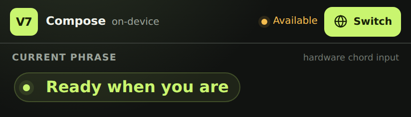
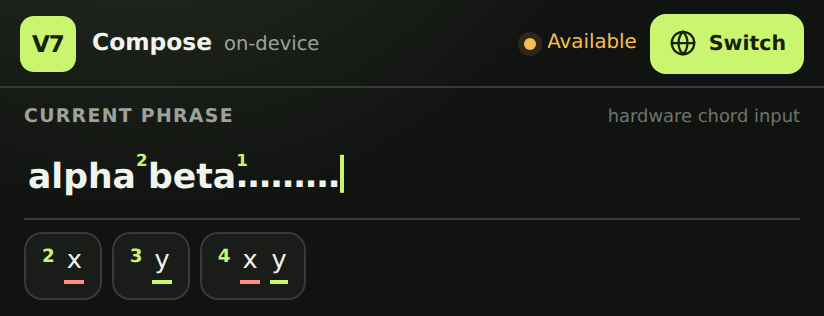
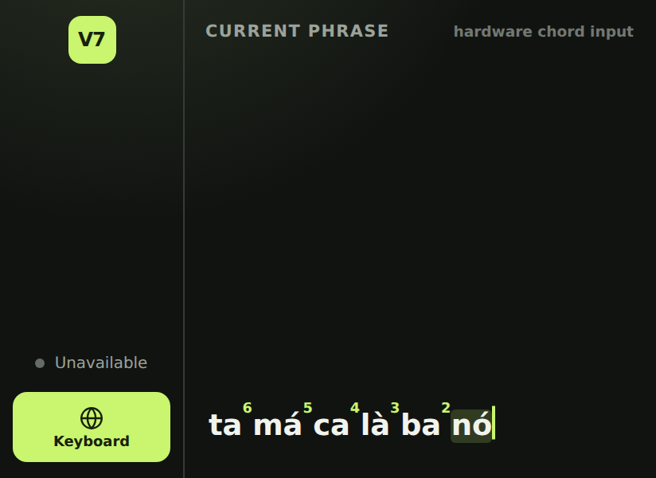

# V7 IME for Android

`ime-android` packages the V7 WebUI as an Android input method with application ID
`com.huynhtrankhanh.v7ime`.

The IME requires Android 8.0 (API 26) or newer. API 26 is the minimum supported
by AndroidX JavaScriptEngine, which owns durable out-of-process dictionary
imports.

## Architecture

- Android uses the dedicated `static/ime.html` and `static/ime.css` interface,
  while sharing the inference and input behavior compiled into `static/script.js`.
  The traditional `static/index.html` WebUI remains structurally and visually
  independent.
- `V7ImeService` hosts that UI in a `WebView`. The WebUI detects
  `window.AndroidIme`, enables stripped display mode, and mirrors its current
  rendered text into Android composing text.
- External hardware key-down and key-up events are captured by the IME and
  forwarded to the WebUI as browser `KeyboardEvent`s. The IME does not render
  an on-screen key layout.
- Inference requests go through JNI to the bundled `inference-rs` and KenLM
  code. No inference request leaves the device.
- Settings can replace the bundled two-syllable lexical dictionary with a
  persistently selected UTF-8 `.txt` document. Each LF- or CRLF-delimited line
  must contain exactly two words; malformed and non-V7 entries are ignored.
  The optional file is opened only for dictionary-mode requests, so an
  unavailable provider cannot disable compositional inference. Provider
  modification metadata invalidates the in-process cache after file edits.
- The language model is not bundled. Android retains a Storage Access Framework
  document grant and passes its seekable file descriptor directly to KenLM,
  which memory-maps it without copying the model into app-private storage.
- Stripped Plover is bundled as a local browser runtime in a process-wide,
  non-visual WebView separate from both the IME interface and dictionary
  manager. Its persistence bridge uses Android's private native SQLite
  database; no Node runtime or external server is required.
- Stripped Plover's host-command events use native Android surfaces:
  `{PLOVER:LOOKUP}` opens an entry lookup whose rows name their source
  dictionary, `{PLOVER:ADD_TRANSLATION}` opens an add form with a writable
  dictionary picker, and `{PLOVER:CONFIGURE}` opens V7 IME settings directly.
- The lookup stroke and add-translation outline fields mark their editor
  context for raw outline capture. V7 then joins physical steno chords with `/`
  and collapses to a labeled 48 dp **Raw outline mode** bar. A lone `*` chord
  removes the latest slash-delimited stroke from the textbox. Translation and
  lookup-text fields use standard V7 and preserve the user's current
  STENO/Normal selection, including the Ctrl+Shift toggle.
- Native command dialogs request the IME surface as soon as their first editor
  is focused, retain it during keyboard navigation, and do not close from an
  accidental outside touch.
- Add-translation uses one-tap, 48 dp dictionary choices; dialog navigation
  keys return to the native activity while those controls have focus, without
  consuming V7's Ctrl+Shift toggle or changing its saved mode. Outline Enter
  advances to translation, and translation Enter submits.
- Moving the cursor or changing editors finishes the active composition and
  clears the WebUI buffer, so already-entered text remains in the editor while a
  new composing session starts cleanly.
- On Android 12 and later, the two candidate-difference regions are attached to
  composing text as grammar `SuggestionSpan`s with their alternative phrases.
- Physical Enter is handled by the service rather than the WebUI: it invokes an
  editor-provided custom or standard action when present, otherwise it forwards
  the original Enter key events to the editor.
- The physical Ctrl+Shift chord switches between STENO capture and ordinary
  hardware-keyboard typing. The chord toggles once per press cycle while solo
  Ctrl and Shift retain their ordinary behavior.
- `Ctrl+Tab` switches between V7/Stripped Plover and Telex composition. From
  Normal typing it enters Telex directly; `Ctrl+Shift` from Telex enters Normal
  typing, while `Ctrl+Shift` from Normal typing returns to V7/Plover. Telex
  keeps the current word as Android PREEDIT, supports ordinary Latin text via
  repeated-mark escapes, and commits/ends PREEDIT at whitespace or symbols.
  Empty-PREEDIT Backspace passes through to the editor, and Enter retains the
  editor's standard Android action behavior after finalizing PREEDIT.
  Numpad and layout-specific printable keys also terminate PREEDIT rather than
  bypassing the Telex composer.
- Normal typing uses a labeled 48 dp status bar, matching the compact active
  Stripped Plover treatment instead of leaving the composition UI visible.
  Compact transitions apply their height immediately, and returning to V7
  restores the last measured full height before the first expanded paint.
- The IME HTML starts with the same empty composition markup used after
  JavaScript initialization and applies native compact-mode classes before its
  layout is parsed, preventing placeholder and full-height layout flicker.
- While STENO capture is active, the physical Q+A chord opens Android's input
  method picker. The `[` key commits the current PREEDIT and starts a clean
  composing session; it does not delete the committed text. The apostrophe key
  commits the current PREEDIT and inserts one space.
- Every physical event carries Android's current Caps Lock state into the
  WebUI. While that state is on, all cased characters produced anywhere in the
  steno pipeline are uppercase, including direct and inferred V7, Emily,
  Stripped Plover, candidate previews, piecemeal replacements, and selected
  candidate output. Choosing a candidate preserves the casing assigned when
  its output was produced; Caps Lock at selection time does not retroactively
  uppercase older candidate or fixed text.
- Connecting or disconnecting a physical keyboard restores the V7 input view
  when an editor is still active. A generation guard prevents a delayed restore
  from showing the IME over an editor that has already closed or changed.

See [Android hardware-keyboard interactions](docs/hardware-keyboard-interactions.md)
for the complete mode table, PREEDIT semantics, and native/WebUI event-routing
order.

See [Telex behavior](docs/telex-behavior.md) for the three-mode state machine
and [the supplied Telex adapter supplement](docs/telex-behavior-supplement.md)
for the converter's detailed key and tone-placement rules.

See [Virtual-keyboard visibility with an external keyboard](docs/keyboard-visibility.md)
for the attach/detach recovery policy, lifecycle safeguards, and verification
matrix.

## Settings

Open **V7 IME** from the launcher or tap its settings entry in Android's
keyboard settings. The native settings activity includes:

- a local `lm.binary` document selected with Android's Storage Access
  Framework;
- a full-screen Stripped Plover dictionary manager opened from settings,
  reusing a phone-friendly browser UI without an Activity action bar or
  nesting editable fields inside the IME;
- durable background dictionary imports in AndroidX's out-of-process
  JavaScript sandbox, with entry counts, phases, and a determinate loading
  notification while native SQLite installs the source transactionally;
- export and import controls for the complete app-private Stripped Plover
  SQLite database;
- an option to save the APK's complete Corresponding Source as
  `v7-ime-source.zip`;
- shortcuts to enable V7 IME and open the input-method picker.

See [Stripped Plover dictionary management on Android](docs/dictionary-management.md)
for the shared WebUI architecture, the deliberately narrow native bridge, and
the import/export file flow.

See [App-data import and export](docs/app-data-transfer.md) for the database
file format, replacement safeguards, and the data that is intentionally not
part of an export.

See [Bundled Stripped Plover runtime](docs/bundled-stripped-plover.md) for the
pinned external-source build, separate engine WebView, background JavaScript
sandbox, typechecked Node compatibility surface, native SQLite implementation,
and artifact licensing boundary.


The bundled Android distribution, including the APK and its Stripped Plover
runtime, is conveyed as a combined work under GPL-3.0-or-later. The APK bundles
its complete Corresponding Source as `v7-ime-source.zip`; Settings can save
that exact asset without network access. The archive contains this repository
plus the exact pinned KenLM and Stripped Plover checkouts, and intentionally
excludes user language models.

Original V7 source files remain separately available under 0BSD. The
distribution-level GPL notice does not replace their 0BSD license, transfer
their copyright, or replace the respective notices on Stripped Plover, KenLM,
and other third-party components.

## IME interface

The IME is a compact companion for an external steno keyboard. It keeps the
reduced composing buffer and fitted alternatives visible without drawing an
on-screen key layout. Its height follows the content: the empty and short-text
states stay compact, while longer text and alternatives receive more room.



Each alternative uses only the width its summary needs. Alternatives pack
beside one another and wrap onto another row only when the remaining width is
insufficient. Android expands the IME to fit those rows; the candidate area
becomes vertically scrollable only after the safe screen-height cap is reached.



Piecemeal mode keeps natural spaces between editable syllables. Its highlight
does not shift the surrounding text, including when the active target is in the
middle of the phrase:



While Stripped Plover is active, the composition interface collapses to a
48 dp status bar:


## Build

The Android build uses JDK 21. It invokes the root WebUI build, fetches and browser-bundles the
pinned Stripped Plover revision, compiles Rust/KenLM for Android, and creates
the source ZIP asset. Install the root JavaScript dependencies, Rust 1.88,
`cargo-ndk`, JDK 21, Android NDK 27.2.12479018, and Gradle:

```sh
npm ci
rustup target add \
  aarch64-linux-android armv7-linux-androideabi \
  x86_64-linux-android i686-linux-android
cargo install cargo-ndk --version 4.1.2 --locked
ANDROID_NDK_HOME="$ANDROID_HOME/ndk/27.2.12479018" \
  gradle -p ime-android assembleDebug
```

The APK is written to:

```text
ime-android/app/build/outputs/apk/debug/app-debug.apk
```

## Signed release pipeline

The manual **Generate V7 IME Release App Bundle** GitHub Actions workflow builds
a signed release App Bundle (`.aab`) from a version name, an optional Android
`versionCode`, and a signing password. It uploads the App Bundle, its SHA-256
checksum, matching bundle/key certificate fingerprints, and a compressed
artifact bundle.

The same flow is available locally after installing the Android, Node, Rust,
and NDK dependencies above:

```sh
V7_SIGNING_PASSWORD='your signing password' \
  ime-android/scripts/build-release-aab.sh "1.0.0" 100
```

Artifacts are written to `android-artifacts/` by default. The release script
derives a deterministic PKCS#12 key from the password when no upload key is
provided. For Play uploads, provide the registered key through
`SIGNING_STORE_FILE`, `SIGNING_STORE_PASSWORD`, `SIGNING_KEY_ALIAS`, and
`SIGNING_KEY_PASSWORD` (plus `SIGNING_STORE_TYPE` when it is not PKCS#12); the
script verifies the generated App Bundle with
`jarsigner`, records the bundle and key SHA-1/SHA-256 certificate fingerprints,
and fails if they differ.

Keep the same derived signing password for compatible updates, or use the
registered Play upload key. The private keystore is temporary build material
and is never copied into `android-artifacts/`.
