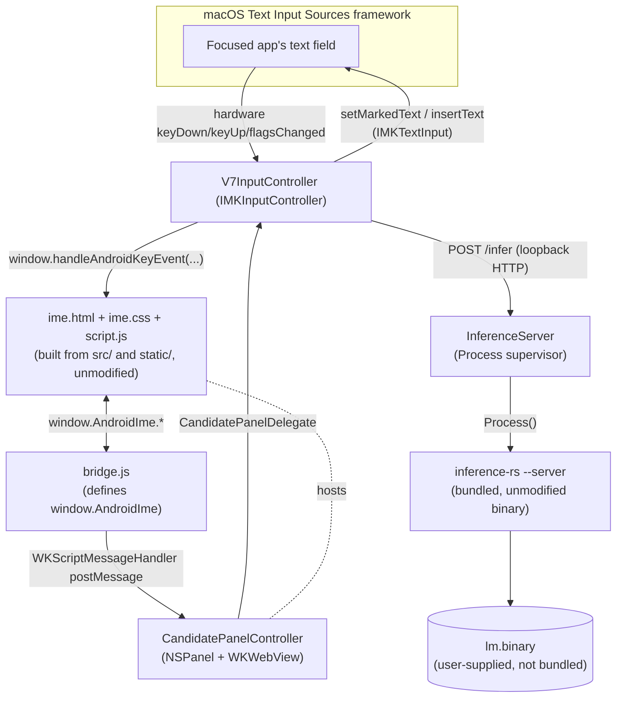

# V7 IME for macOS

`ime-macos` packages the V7 web UI as a real macOS system Input Method
(`com.huynhtrankhanh.v7ime.mac`), the macOS counterpart to
[`ime-android`](../ime-android/README.md). It installs into
`~/Library/Input Methods`, appears in **System Settings > Keyboard > Input
Sources**, and composes marked (preedit) text directly into whatever app has
focus — the same role `V7ImeService` plays on Android.

## Architecture



- **`V7InputController`** (`Sources/V7ImeMac/V7InputController.swift`) is the
  macOS analogue of `V7ImeService`: it captures hardware key events via
  `handle(_:client:)`, forwards them into the web UI exactly like Android's
  `dispatchPhysicalKeyToWeb`, and maps composing/committed text onto
  `IMKTextInput.setMarkedText` / `insertText` the way Android maps it onto
  `InputConnection.setComposingText` / `finishComposingText`.
- **`CandidatePanelController`** (`Sources/V7ImeMac/CandidatePanel.swift`) is
  a non-activating floating `NSPanel` hosting a `WKWebView`, playing the same
  role as `V7ImeService`'s `WebView`. It loads the **exact same**
  `static/ime.html` + `static/ime.css` + `static/script.js` that
  `ime-android` loads into its `WebView` — nothing under `src/` or `static/`
  was changed to support macOS.
- **`Resources/bridge.js`** defines `window.AndroidIme` with the identical
  method set Android's `AndroidBridge` exposes via `addJavascriptInterface`
  (see `AndroidImeBridge` in `src/main.ts`). Because `script.js` already
  feature-detects `window.AndroidIme` and branches its behavior accordingly
  (stripped display mode, bridge-routed inference instead of `fetch`,
  `setPreeditText` instead of an on-screen keyboard), defining that one
  global object is enough to reuse the whole web UI verbatim. See "The
  `window.AndroidIme` bridge" below for why a couple of its methods needed a
  small cross-platform trick.
- **`InferenceServer`** (`Sources/V7ImeMac/InferenceServer.swift`) launches
  the bundled `inference-rs` binary as a child process in server mode
  (`--server --port 51823 --static-dir ... --model-path ...`) — the exact
  same binary and flags documented in the root
  [`README.md`](../README.md#run-the-web-demo-server-mode) — and proxies
  `/infer` requests to it over loopback HTTP. This is the "local HTTP
  server" integration approach (as opposed to a new native FFI layer): it
  reuses 100% of `inference-rs` unmodified, at the cost of an extra loopback
  hop compared to Android's in-process JNI call.

## The `window.AndroidIme` bridge

`WKScriptMessageHandler` (used for JS -> native calls) is asynchronous only;
there is no WKWebView equivalent of Android's synchronous
`@JavascriptInterface` methods. But a few `AndroidImeBridge` methods
(`getInferenceModelState`, `getInferenceModelError`, `isStenoModeEnabled`,
`isRawOutlineMode`, `isPloverPaused`, `hasPloverConfiguration`) are called as
plain synchronous getters by `src/main.ts` — always to seed a local variable
once at startup, then never polled again (subsequent updates always arrive
through push callbacks like `window.handleAndroidInferenceState`,
which already exist and are unchanged).

`bridge.js` resolves this by keeping a small cache (`window.__v7MacBridgeState`)
that native code updates via `evaluateJavaScript` immediately after any real
state change, mirroring the push callbacks Android already relies on. The
getters just read that cache synchronously. No polling, no round trip.

## Known limitations (v1)

This is a first, functional pass, scoped deliberately to keep the surface
area reviewable. Documented gaps, matched against `ime-android`'s feature
set:

- **No Stripped Plover.** Android bundles a full Stripped Plover runtime
  (WASM sandbox, native SQLite dictionary, TCP proxy). This is a large
  subsystem on its own; v1 reports `hasPloverConfiguration() -> false` and
  fails `requestPlover` calls immediately instead of hanging.
- **No raw-outline mode, no dictionary manager, no Settings UI.** The only
  configuration surface is `scripts/set-model-path.sh` plus
  `~/Library/Application Support/V7ImeMac/config.json`.
- **Candidate panel position is approximate.** It's anchored on the mouse
  pointer position captured when the input session activates, not the exact
  caret rectangle (`IMKTextInput.attributes(forCharacterIndex:lineHeightRectangle:)`
  is implemented inconsistently across third-party text fields). Good enough
  to be usable; a precise version is a reasonable follow-up.
- **No grammar/candidate-diff highlighting** in the composed text (Android's
  `SuggestionSpan` equivalent) — the candidate list in the panel still shows
  every alternative, just without underlined diff spans in the marked text
  itself.
- **NKRO fidelity through `IMKInputController.handle(_:client:)` is
  unverified at scale.** The V7 chord model needs true multi-key rollover
  (see the root [`MANIFESTO.md`](../MANIFESTO.md)'s NKRO check for the
  trainer). `recognizedEvents` requests `keyDown`/`keyUp`/`flagsChanged`
  explicitly (IMKit does not deliver `keyUp` by default), and this was
  smoke-tested to build and run, but has not been chord-tested end-to-end
  against a real NKRO steno keyboard in a live text field yet — that
  requires manually enabling the input source in System Settings, which
  needs a human at the keyboard. Please test with your hardware and file
  issues for anything that misbehaves.
- **Ad-hoc code signing only.** `codesign --sign -` is enough to run and
  register locally; distributing this to other Macs would need a real
  Developer ID (and, if Stripped Plover is ever added, the same
  `v7-ime-source.zip` GPL Corresponding Source treatment `ime-android` uses).

## A note on two upstream build fixes

Getting `inference-rs` to build on macOS at all required two small,
platform-general fixes (not committed to a macOS-only fork — they're in
[`inference-rs/build.rs`](../inference-rs/build.rs) and affect every
non-Linux host build):

1. **KenLM's `LoadVirtual` fd overload.** `inference-rs/cpp/wrapper.cc`'s
   `load_model_fd` calls an fd-based `lm::ngram::LoadVirtual` overload that
   only exists once
   [`ime-android/patches/kenlm-load-from-fd.patch`](../ime-android/patches/kenlm-load-from-fd.patch)
   is applied. That patch was previously only wired into the Android NDK
   build path; `scripts/build-kenlm-macos.sh` applies the same patch before
   building KenLM for the host Mac.
2. **GNU-only linker flags.** `build.rs` unconditionally emitted
   `-Wl,--start-group` / `-Wl,--end-group` (GNU ld's archive-grouping
   syntax) and `-lstdc++`/`-ldl`. Apple's linker doesn't understand
   `--start-group`/`--end-group` and macOS has no `libstdc++` (it ships
   `libc++`). `build.rs` now only emits the group flags on
   `target_os = "linux"` and links `c++` instead of `stdc++` on macOS.

Both fixes are backward-compatible with the existing Linux/Docker build.

## Building

Prerequisites (all confirmed present and sufficient on Xcode 26 /
Swift 6 / macOS 12+):

- Xcode command-line tools (`xcode-select -p`) — provides `swift`, `clang`,
  `codesign`.
- `cmake` and Boost (`brew install cmake boost`).
- Rust (`cargo`, `rustc`); optionally both `rustup target add
  aarch64-apple-darwin x86_64-apple-darwin` for a universal binary.
- Node.js + npm (for the shared `src/` -> `static/script.js` build).

```sh
cd ime-macos
./scripts/package-app.sh
```

This runs, in order:

1. `build-kenlm-macos.sh` — clones `kpu/kenlm` at the pinned revision in
   [`ime-android/KENLM_REVISION`](../ime-android/KENLM_REVISION) into
   `../kenlm`, applies the fd-load patch, and builds it with CMake.
2. `build-inference-macos.sh` — builds `inference-rs` for macOS (universal
   if both Rust targets are installed, host-only otherwise) and stages it at
   `build/inference-rs`.
3. `sync-webui.sh` — runs the root `npm ci && npm run build` and stages
   `ime.html` / `ime.css` / `script.js` at `build/static/`.
4. `swift build -c release`, then assembles and ad-hoc code-signs
   `build/V7ImeMac.app`.

Each script can also be run standalone (e.g. to rebuild just the Rust binary
after a `src/main.rs` change: `./scripts/build-inference-macos.sh`).

## Install and enable

```sh
./scripts/set-model-path.sh ~/Downloads/lm.binary   # or wherever your lm.binary lives
./scripts/install.sh
```

`install.sh` copies `build/V7ImeMac.app` to `~/Library/Input Methods` and
re-registers it with Launch Services. From there, **one manual step is
required** — macOS has no API to add an input source to a user's enabled
list without user interaction:

1. Open **System Settings > Keyboard > Input Sources**.
2. Click **Edit...**, then **+**.
3. Find **V7 Vietnamese IME** (or search "Vietnamese") and add it.
4. Switch to it from the input menu (the flag/globe icon in the menu bar) or
   its keyboard shortcut.
5. Click into any text field and start chording on an external NKRO
   keyboard, exactly as described in the root
   [`README.md`](../README.md#v7-input-format-deep-dive) and
   [`README_WEB.md`](../README_WEB.md).

`lm.binary` is intentionally **not** bundled in the `.app` (it's a
600+ MB generated artifact — see the root README's "Training the Language
Model"). `Preferences.swift` looks for it, in order: the path set by
`set-model-path.sh`, `~/Library/Application Support/V7ImeMac/lm.binary`,
then `~/Downloads/lm.binary`.

To remove it: `./scripts/uninstall.sh`.

## Verifying the inference server independently

Useful when something seems wrong and you want to rule the web UI /
IMKInputController layer out:

```sh
./build/V7ImeMac.app/Contents/MacOS/V7ImeMac &
curl -s -X POST http://127.0.0.1:51823/infer \
  -H "Content-Type: application/json" \
  -d '{"islands":["", "tro2ma1", ""]}'
```

A healthy response is a JSON object like `{"candidates":[["","trời mấy",""],...]}`.
Logs (subprocess stderr, state transitions) go to Console.app under the
`com.huynhtrankhanh.v7ime.mac` subsystem (`log stream --predicate
'subsystem == "com.huynhtrankhanh.v7ime.mac"'`).

## Source layout

```text
ime-macos/
  Package.swift
  Sources/V7ImeMac/
    main.swift              Entry point; constructs the IMKServer.
    V7InputController.swift IMKInputController: key capture + text composition.
    CandidatePanel.swift    NSPanel + WKWebView + WKScriptMessageHandler.
    InferenceServer.swift   inference-rs subprocess supervisor + /infer proxy.
    KeyCodeMapping.swift    macOS virtual keycode -> DOM key/code, mirrors
                             V7ImeService.getJavascriptKey/getJavascriptCode.
    AppContext.swift        Process-wide singletons (resources dir, server).
    Preferences.swift       lm.binary path resolution/storage.
    Logging.swift           os.Logger categories.
  Resources/
    Info.plist              IMKit registration keys.
    bridge.js                Defines window.AndroidIme for the WKWebView.
  scripts/
    build-kenlm-macos.sh
    build-inference-macos.sh
    sync-webui.sh
    package-app.sh
    install.sh
    uninstall.sh
    set-model-path.sh
```
